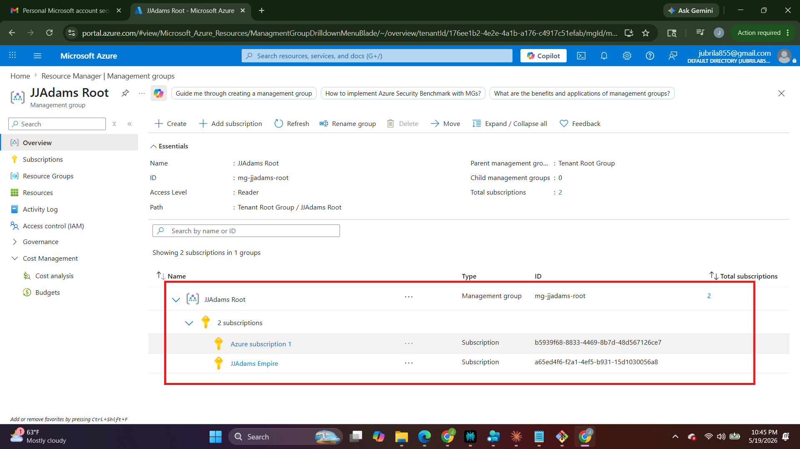
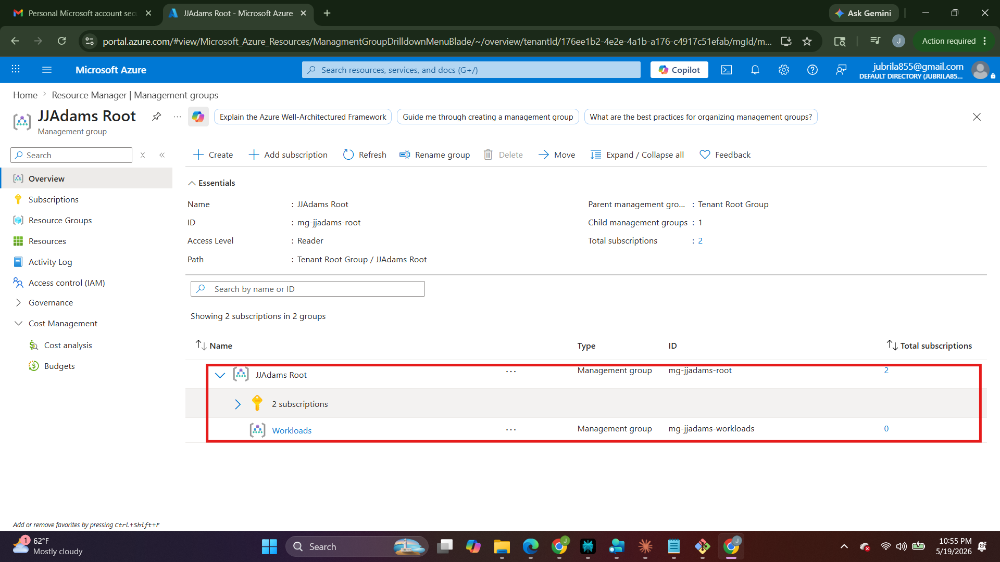
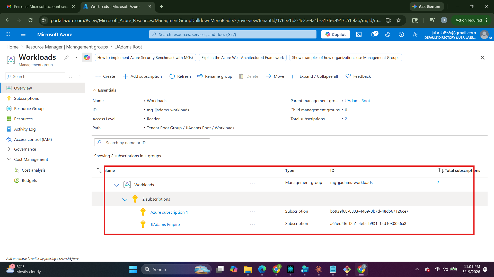
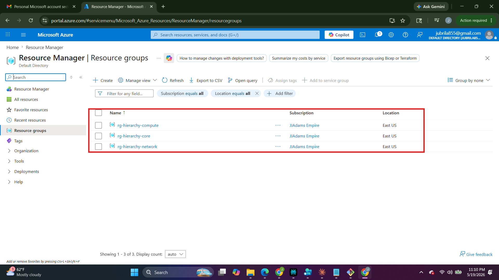
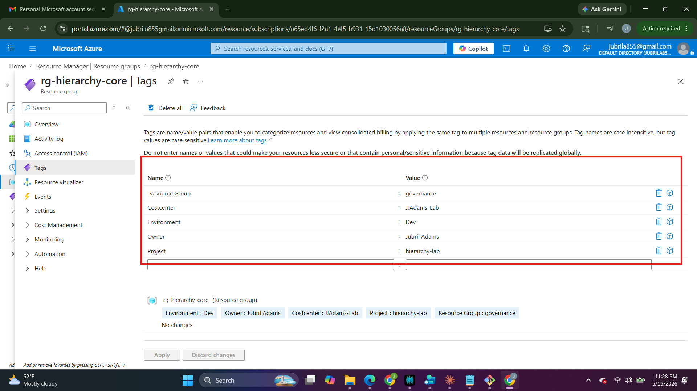
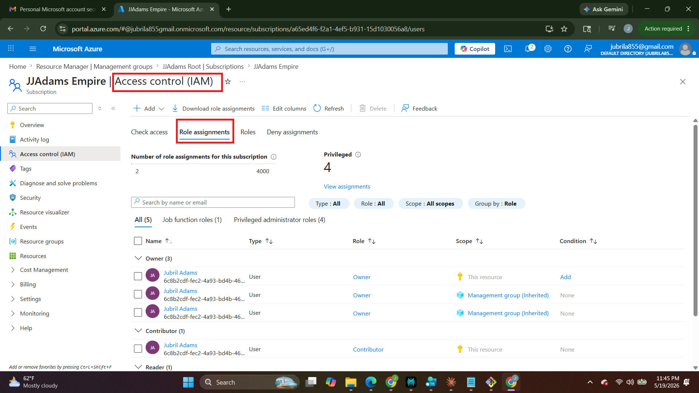
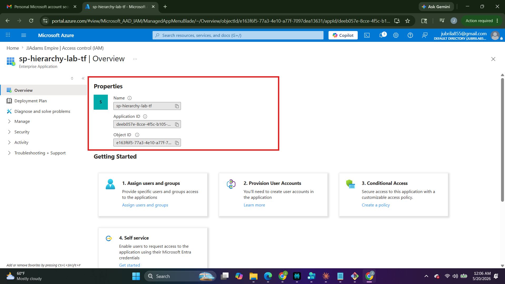
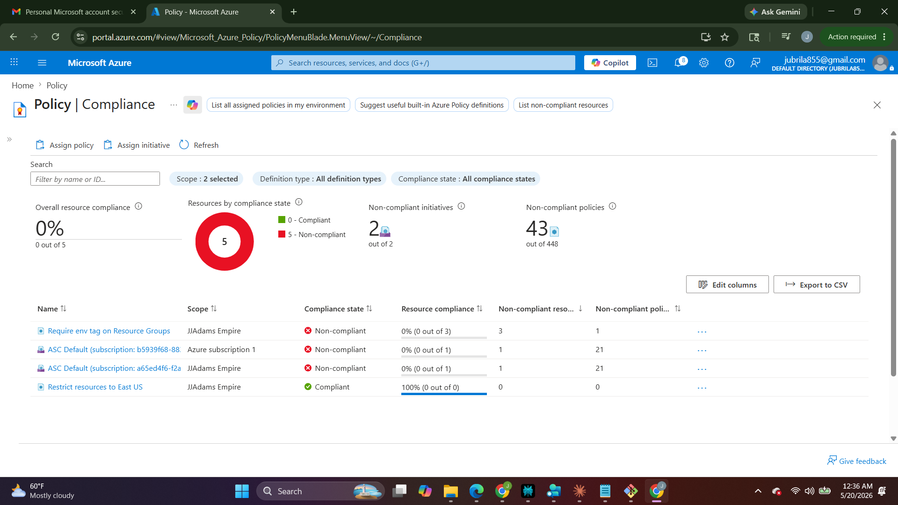
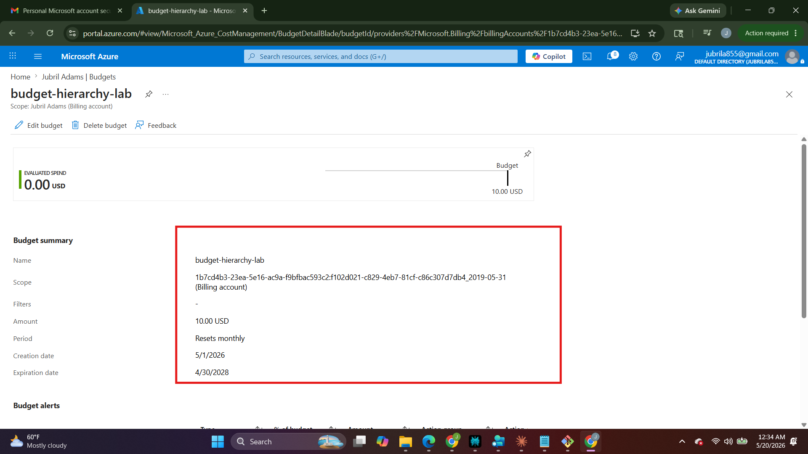

# 🏗️ Azure Resource Hierarchy Lab

  

> Azure governance lab: Management Groups, Subscriptions, Resource Groups, RBAC, and Azure Policy — fully codified in Terraform IaC with GitHub Actions CI/CD.

## 🎯 What This Lab Demonstrates

- Management Group hierarchy design (Tenant Root → Root MG → Workloads MG)
- Subscription scoped under management group for policy inheritance
- Resource Group naming and tagging strategy (env, owner, costcenter, tier)
- RBAC least-privilege assignments at Management Group and Subscription scope
- Azure Policy assignments: tag enforcement (Audit) + allowed locations (Deny)
- Terraform IaC with remote state stored in Azure Blob Storage
- GitHub Actions pipeline: plan on PR, apply on main merge

## 🏛️ Architecture

Tenant Root Group → mg-jjadams-root → mg-jjadams-workloads → Subscription → RGs

| Resource Group | Region | Purpose |
|---|---|---|
| rg-hierarchy-core | East US | Governance, Key Vault, Log Analytics |
| rg-hierarchy-network | East US | VNet, NSG, Subnets |
| rg-hierarchy-compute | East US | VMs, AKS, Storage |

## 📁 Repository Structure

terraform/  Terraform modules and environments
policies/   Azure Policy definitions and assignments
scripts/    Azure CLI and PowerShell scripts
docs/       Architecture docs and screenshots

## 📸 Lab Evidence

### Management Group Hierarchy

### Resource Groups and Tags

### RBAC and Identity

### Policy and Cost Controls

## 🧑‍💼 Author

Jubril Adams · Azure Administrator (AZ-104) · CompTIA Cloud+ · AWS SAA
[LinkedIn](https://linkedin.com/in/jubriladams) · [GitHub](https://github.com/jubriladams78)
